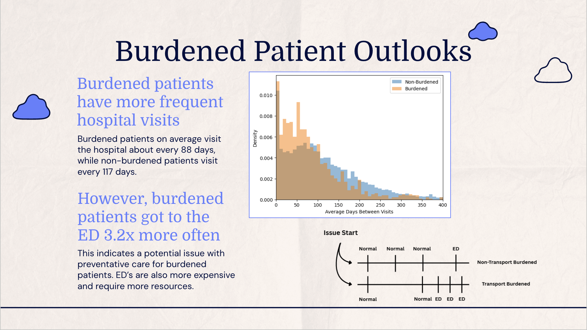

# Miles to Care: Transportation Barriers & Patient Journeys

## ASA DataFest 2026 — Virginia Tech
**[View Final Presentation](datafest-final-presentation.pdf)**
**[View R Data Preparation & Feature Engineering Code](R/cohort_feature_engineering.R)**

This project analyzes transportation barriers and their relationship to healthcare utilization and patient journeys using data provided by Stormont Vail Health for ASA DataFest 2026.

Our team examined a dataset containing approximately 7.7 million healthcare encounters and focused on whether transportation barriers were associated with differences in emergency department use, visit frequency, and continuity of care.

### Project Focus

The analysis explored questions including:

- Do patients experiencing transportation barriers use the emergency department more frequently?
- Are there differences in the time between healthcare visits?
- How do transportation barriers interact with other social determinants of health?
- What interventions could improve access to appropriate and preventative care?

### Tools Used

- R
- tidyverse
- data.table
- lubridate
- Statistical modeling
- Data visualization
- Feature engineering

### Privacy Note

The original healthcare datasets provided for ASA DataFest are not included in this repository. This repository contains only code, methodology, and approved project materials.

## My Contribution

I focused primarily on **data ingestion, cohort construction, and feature engineering in R**.

My work included:

- Loading and organizing multiple healthcare datasets, including approximately **7.7 million encounter records**
- Identifying patients who reported transportation barriers from social determinants of health screening data
- Building patient- and encounter-level transportation indicators
- Joining encounter, patient demographic, diagnosis, department, and social determinant data
- Constructing an analysis cohort containing the complete encounter histories of transportation-screened patients
- Engineering longitudinal patient-journey features, including:
  - Days between encounters
  - Journey duration
  - Number of encounters
  - Emergency department utilization
  - Long gaps in care
- Creating patient-level summary datasets for downstream statistical modeling and visualization

This work produced the analysis-ready datasets used by the team to investigate the relationship between transportation barriers and healthcare utilization.

## Key Findings



Our analysis found meaningful differences in healthcare utilization among patients who reported transportation barriers:

- Transportation-burdened patients visited the healthcare system approximately every **88 days**, compared with **117 days** for patients without a reported transportation burden.
- Transportation-burdened patients used the **emergency department 3.2× more frequently**.
- In an OLS regression controlling for age, race, and smoking status, transportation-burdened patients had approximately **44 fewer days between visits** (`p = 0.019`).
- In a logistic regression controlling for demographic and social factors, transportation burden was the strongest predictor of emergency department utilization, with an estimated **odds ratio of 2.88** (`p = 0.00097`).

### Business / Healthcare Implication

The results suggested that transportation barriers may not simply cause patients to miss care. Instead, affected patients may be receiving care more frequently in higher-cost settings such as the emergency department.

Our team recommended:

- Identifying patients with transportation barriers and other social risk factors for enhanced outreach
- Encouraging more frequent preventative care for high-risk patients
- Expanding telehealth options when clinically appropriate to reduce transportation-related barriers

### Competition Result

**1st Place — ASA DataFest Virginia Tech 2026**

Our team, Peak Performance Partners, placed first out of 50 participating teams.

## Repository Structure

```text
miles-to-care-datafest-2026/
│
├── R/
│   └── cohort_feature_engineering.R
│
├── datafest-final-presentation.pdf
├── README.md
└── .gitignore
